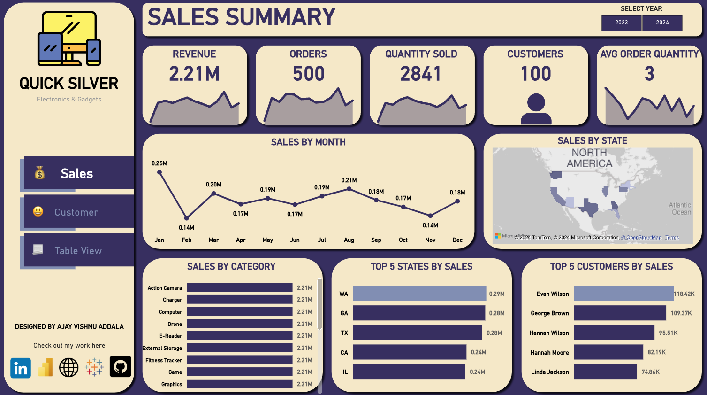

# Electronic Sales - Power BI Dashboard

This project aims to create a comprehensive Power BI dashboard using fake sales data. The dashboard provides insights into various key performance indicators (KPIs) related to sales, customers, and products.

## Introduction
In this project, I have created a Power BI dashboard to visualize and analyze sales data. The dashboard is designed to provide valuable insights into sales performance, customer behavior, and product trends. It includes various visualizations and KPIs to facilitate data-driven decision-making.

## Dashboard Overview

The dashboard consists of the following main pages:

1. **Sales Summary Page**: Provides an overview of sales performance, including revenue, orders, quantity sold, and average order value. It also includes a monthly trend chart to visualize sales over time, top customers by revenue.

2. **Customer Page**: Customer-wise KPIs.

3. **Table View Page**: For users who prefer a tabular view, this page presents a detailed table view of the underlying sales data.

## Data Source
The data for this project is stored in a SQL Server database. I have cleaned and processed the data before importing it into Power BI for analysis. The dataset includes fake sales transactions with information about customers, products, orders, and sales amounts.

## Installation
To install and run this Power BI dashboard locally, follow these steps:

1. Clone this repository to your local machine.
2. Open the Power BI file (.pbix) using Power BI Desktop.
3. Ensure that the SQL Server connection is configured correctly.
4. Refresh the data in Power BI to fetch the latest dataset.
5. Explore the dashboard and visualizations.

## Usage
Once the dashboard is set up, you can use it to gain insights into various aspects of sales performance. Here are some tips for using the dashboard effectively:

- Use filters to drill down into specific time periods, product categories, or customer segments.
- Hover over visualizations to view detailed information and tooltips.
- Experiment with different chart types and layouts to find the most informative views.
- Share the dashboard with stakeholders and team members to facilitate collaborative decision-making.

